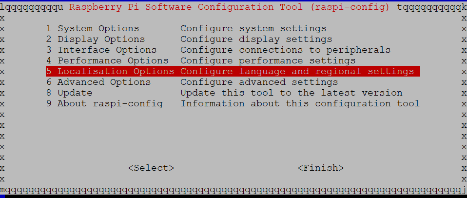
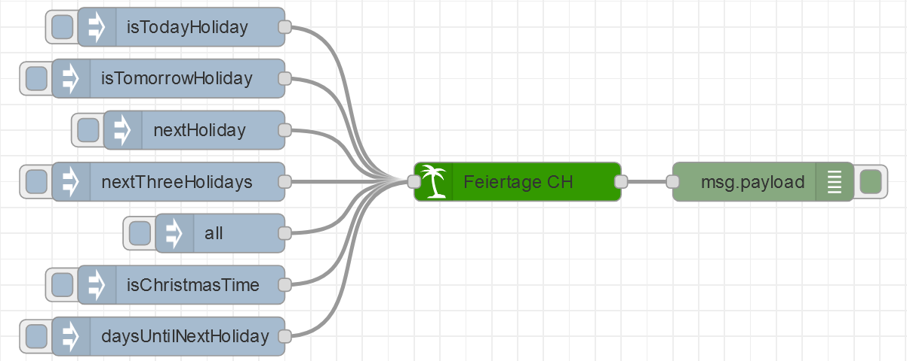

# Node Red Feiertage Switzerland

[](https://www.npmjs.com/package/node-red-contrib-feiertage-switzerland)
[](https://www.npmjs.com/package/node-red-contrib-feiertage-switzerland)
[](https://github.com/MariusLang/node-red-contrib-feiertage-switzerland/issues)

[](https://nodei.co/npm/node-red-contrib-feiertage-switzerland/)

The Node Red **Feiertage Switzerland** node is the ultimate node to get information about swiss holidays.

Is there any holiday missing? Write an issue! I'm going to add this holiday for you.

This node was split out of the [node-red-contrib-feiertage](https://github.com/MariusLang/node-red-contrib-feiertage)
node. This Node only contains **Swiss** holidays.
To get this node for another country read the point below.

## You're living in Germany, Austria or Switzerland?

| country                                                     | node-red node                                                                                                  |
|-------------------------------------------------------------|----------------------------------------------------------------------------------------------------------------|
| Germany                                                     | [node-red-contrib-feiertage-germany](https://github.com/MariusLang/node-red-contrib-feiertage-germany)         |
| Austria                                                     | [node-red-contrib-feiertage-austria](https://github.com/MariusLang/node-red-contrib-feiertage-austria)         |
| Switzerland                                                 | [node-red-contrib-feiertage-switzerland](https://github.com/MariusLang/node-red-contrib-feiertage-switzerland) |
| Or you want all in one node (Germany, Austria, Switzerland) | [node-red-contrib-feiertage](https://github.com/MariusLang/node-red-contrib-feiertage)                         |

## Installation

```
npm install node-red-contrib-feiertage-switzerland
```

## Getting Started

At first, it's important to check that you have picked the rigth localisation and timezone on your device. Below you can
find a manual how to change those settings on to a RaspberryPi.

Login into your Pi. Then open the settings with this command.

```
sudo raspi-config
```

Now you should see this interface. Navigate to **5 Localisation Options** and press ENTER.



Here you can set your **Local** and **Timezone**.
If your localisation is Switzerland chose **de_CH.UTF-8** as your local and **Europe** --> **Zürich** as your timezone.


After you have finished setup click **Finish**.
To make your changes valid reboot your pi.

```
sudo reboot
```

## Node Description

### Input

The input can be used to trigger special outputs. The keywords are listed below.

| msg.payload       | output                                                                    |
|-------------------|---------------------------------------------------------------------------|
| isTodayHoliday    | boolean whether today is holiday                                          |
| isChristmasTime   | boolean whether today is Christmas time (1. Advent - Heilige drei Könige) |
| nextHoliday       | information about next holiday                                            |
| nextThreeHolidays | information about next 3 holidays                                         |
| all               | information about all holidays                                            |

### Output

The output can be used to listen to automatic and user triggered events. Every day at 00:01 o'clock the node
automatically outputs a boolean value whether today is a holiday.

You decide what you want to receive: Object or Array!
To enable output as array open the node settings and hit the checkbox **output: Array instead of Object** at the bottom.

holiday object output:

| key     | output                   |
|---------|--------------------------|
| id      | id                       |
| name    | name                     |
| dateObj | date (yyyy-mm-dd)        |
| dateDE  | german date (dd.mm.yyyy) |

holiday array[3] output:

| index | output                   |
|-------|--------------------------|
| 0     | id                       |
| 1     | name                     |
| 2     | date (yyyy-mm-dd)        |
| 3     | german date (dd.mm.yyyy) |

Every day at 12 am you will receive a boolean value whether today is a holiday if daily output is enabled.

### Own Holidays

You can choose up to 10 own dates. Select the **day** in the first dropdown-menu and the **month** in the second. Chose
a name for your holiday and type it into the input field. Don't forget to hit the checkbox to enable your own holiday.
Pay attention: The node does NOT validate your own dates. So if you set the 30 february or the 31 april as date you
won't get an error message.


## Example Flow

You can import this example into your Node Red flow.



```
[{"id":"a0a252dd4010be37","type":"inject","z":"d92a1f96.826db","name":"","props":[{"p":"payload"}],"repeat":"","crontab":"","once":false,"onceDelay":0.1,"topic":"","payload":"nextHoliday","payloadType":"str","x":170,"y":1120,"wires":[["fc2b23be554303c7"]]},{"id":"6dfeb8669462f17b","type":"debug","z":"d92a1f96.826db","name":"","active":true,"tosidebar":true,"console":false,"tostatus":false,"complete":"false","statusVal":"","statusType":"auto","x":610,"y":1160,"wires":[]},{"id":"0691b5a7836586fb","type":"inject","z":"d92a1f96.826db","name":"","props":[{"p":"payload"}],"repeat":"","crontab":"","once":false,"onceDelay":0.1,"topic":"","payload":"isTodayHoliday","payloadType":"str","x":160,"y":1040,"wires":[["fc2b23be554303c7"]]},{"id":"6c858cf35ba5a6ab","type":"inject","z":"d92a1f96.826db","name":"","props":[{"p":"payload"}],"repeat":"","crontab":"","once":false,"onceDelay":0.1,"topic":"","payload":"nextThreeHolidays","payloadType":"str","x":150,"y":1160,"wires":[["fc2b23be554303c7"]]},{"id":"bc0dfe8537901d03","type":"inject","z":"d92a1f96.826db","name":"","props":[{"p":"payload"}],"repeat":"","crontab":"","once":false,"onceDelay":0.1,"topic":"","payload":"all","payloadType":"str","x":190,"y":1200,"wires":[["fc2b23be554303c7"]]},{"id":"7fac1b4755b4cb6c","type":"inject","z":"d92a1f96.826db","name":"","props":[{"p":"payload"}],"repeat":"","crontab":"","once":false,"onceDelay":0.1,"topic":"","payload":"isChristmasTime","payloadType":"str","x":160,"y":1240,"wires":[["fc2b23be554303c7"]]},{"id":"7652564b16597f3e","type":"inject","z":"d92a1f96.826db","name":"","props":[{"p":"payload"}],"repeat":"","crontab":"","once":false,"onceDelay":0.1,"topic":"","payload":"daysUntilNextHoliday","payloadType":"str","x":150,"y":1280,"wires":[["fc2b23be554303c7"]]},{"id":"c1fd18e496371613","type":"inject","z":"d92a1f96.826db","name":"","props":[{"p":"payload"}],"repeat":"","crontab":"","once":false,"onceDelay":0.1,"topic":"","payload":"isTomorrowHoliday","payloadType":"str","x":150,"y":1080,"wires":[["fc2b23be554303c7"]]},{"id":"fc2b23be554303c7","type":"feiertageCH","z":"d92a1f96.826db","name":"Feiertage CH","neujahr":true,"neujahrName":"Neujahr","berchtoldstag":true,"berchtoldstagName":"Berchtoldstag","heiligeDreiKoenige":true,"heiligeDreiKoenigeName":"Heilige drei Könige","weiberfastnacht":true,"stJosef":true,"stJosefName":"Josefstag","gruendonnerstag":true,"gruendonnerstagName":"Gründonnerstag","karfreitag":true,"karfreitagName":"Karfreitag","easterSunday":true,"easterSundayName":"Ostersonntag","easterMonday":true,"easterMondayName":"Ostermontag","firstMay":true,"firstMayName":"Tag der Arbeit","christiHimmelfahrt":true,"christiHimmelfahrtName":"Christi Himmelfahrt","pfingstsonntag":true,"pfingstsonntagName":"Pfingstsonntag","pfingstmontag":true,"pfingstmontagName":"Pfingstmontag","fronleichnam":true,"fronleichnamName":"Fronleichnam","peterUndPaul":true,"peterUndPaulName":"Peter und Paul","bundesfeierCH":true,"bundesfeierCHName":"Bundesfeiertag","mariaHimmelfahrt":true,"mariaHimmelfahrtName":"Maria Himmelfahrt","nationalfeiertagAT":true,"nationalfeiertagATName":"Nationalfeiertag","halloween":true,"halloweenName":"Halloween","allerheiligen":true,"allerheiligenName":"Allerheiligen","nikolaus":true,"nikolausName":"Nikolaus","mariaeEmpfaengnis":true,"mariaeEmpfaengnisName":"Mariä Empfängnis","advent1":true,"advent1Name":"1. Advent","advent2":true,"advent2Name":"2. Advent","advent3":true,"advent3Name":"3. Advent","advent4":true,"advent4Name":"4. Advent","heiligabend":true,"heiligabendName":"Heiligabend","weihnachten1":true,"weihnachten1Name":"Weihnachten","weihnachten2":true,"weihnachten2Name":"Stephanstag","silvester":true,"silvesterName":"Silvester","ownHoliday1":true,"ownHoliday1Day":"28","ownHoliday1Month":"12","ownHoliday1Name":"own Date 1","ownHoliday2":false,"ownHoliday2Day":2,"ownHoliday2Month":2,"ownHoliday2Name":"own Date 2","ownHoliday3":false,"ownHoliday3Day":3,"ownHoliday3Month":3,"ownHoliday3Name":"own Date 3","ownHoliday4":false,"ownHoliday4Day":4,"ownHoliday4Month":4,"ownHoliday4Name":"own Date 4","ownHoliday5":false,"ownHoliday5Day":5,"ownHoliday5Month":5,"ownHoliday5Name":"own Date 5","ownHoliday6":false,"ownHoliday6Day":6,"ownHoliday6Month":6,"ownHoliday6Name":"own Date 6","ownHoliday7":false,"ownHoliday7Day":7,"ownHoliday7Month":7,"ownHoliday7Name":"own Date 7","ownHoliday8":false,"ownHoliday8Day":8,"ownHoliday8Month":8,"ownHoliday8Name":"own Date 8","ownHoliday9":false,"ownHoliday9Day":9,"ownHoliday9Month":9,"ownHoliday9Name":"own Date 9","ownHoliday10":false,"ownHoliday10Day":10,"ownHoliday10Month":10,"ownHoliday10Name":"own Date 10","array":false,"dailyOutput":true,"x":420,"y":1160,"wires":[["6dfeb8669462f17b"]]}]
```
